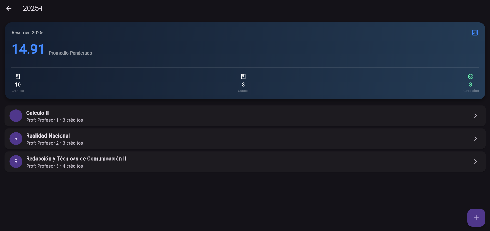
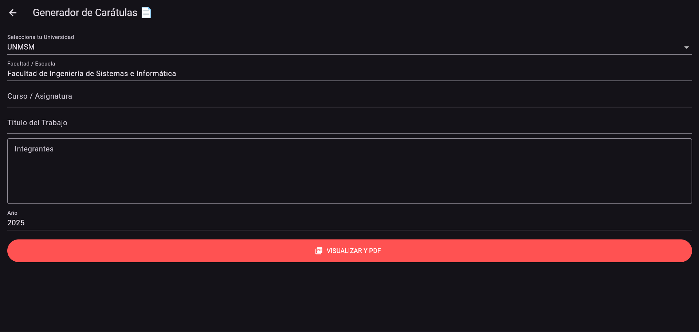
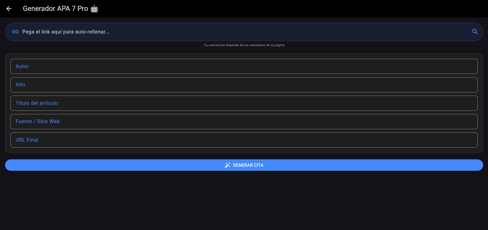
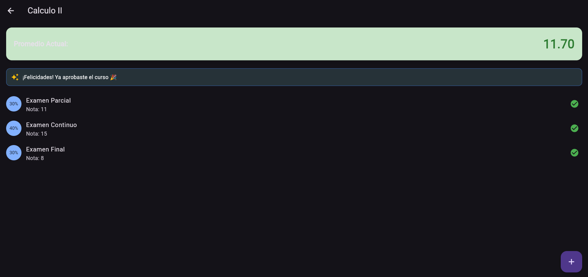

# 🎓 StudyFlow


> **Tu compañero académico integral.** Centraliza la gestión de notas, automatiza formatos repetitivos y mantén el control de tu semestre.

---

## 📱 Descripción del Proyecto

**StudyFlow** es una aplicación multiplataforma (Móvil & Desktop) diseñada para estudiantes universitarios que necesitan más que una simple agenda. El proyecto nace de la necesidad de centralizar la gestión académica y automatizar tareas burocráticas como la creación de carátulas y referencias bibliográficas.

Construida con **Flutter** y siguiendo los principios de **Clean Architecture**, StudyFlow es un proyecto *Offline-First* que garantiza rendimiento y persistencia local segura.

---

## ✨ Características Principales

### 📊 1. Gestión Académica (Core)
- **Dashboard en Tiempo Real:** Visualización inmediata del Promedio Ponderado Semestral, créditos matriculados y cursos aprobados.
- **Sistema de Notas Flexible:** Registro de evaluaciones con pesos porcentuales personalizados (ej: Parcial 30%, Final 40%).
- **Cálculo "Salva Semestres":** Lógica predictiva que te indica cuánto necesitas sacar en tu examen final para aprobar el curso.
- **Historial de Ciclos:** Organización por semestres (2025-I, 2025-II, etc.).

### 🛠️ 2. Módulo de Herramientas (AutoTemplate)
- **📄 Generador de Carátulas PDF:** - Crea portadas oficiales en segundos seleccionando tu universidad (UNMSM, UNI, etc.).
  - Exportación directa a PDF listo para imprimir o adjuntar.
  - Soporte para logos dinámicos y listas de integrantes.
- **🤖 Generador APA 7 Pro:** - Web Scraping de metadatos: Pega un link y la app extrae el Título, Sitio Web y Año automáticamente.
  - Formateo automático de referencias bibliográficas listo para copiar al portapapeles.

---

## 📸 Galería

| Dashboard Global | Generador PDF (UNMSM) |
|:---:|:---:|
|  |  |
| *Resumen de notas y promedios en tiempo real* | *Exportación de carátulas formales* |

| Generador APA 7 | Gestión de Notas |
|:---:|:---:|
|  |  |
| *Extracción automática de metadatos web* | *Cálculo de promedios ponderados* |

---

## 🏗️ Arquitectura y Tecnologías

El proyecto sigue una estructura basada en **Clean Architecture**, separando las capas para asegurar escalabilidad y testabilidad:

- **Presentation:** Widgets, Screens, Providers.
- **Domain:** Entities, Repositories (Interfaces), UseCases.
- **Data:** Models (Hive Adapters), Data Sources, Repository Implementations.

### Stack Tecnológico:
* **Framework:** Flutter (Dart).
* **Base de Datos Local:** [Hive](https://pub.dev/packages/hive) (NoSQL, rápida y ligera).
* **Generación PDF:** `pdf` & `printing`.
* **Web Scraping:** `metadata_fetch` (OpenGraph parser).
* **Formularios:** `flutter_form_builder`.
* **Gestión de Estado:** `ValueListenableBuilder` (Nativo).

---

## 🚀 Instalación y Ejecución

Sigue estos pasos para correr el proyecto en tu máquina local:

1.  **Clonar el repositorio:**
    ```bash
    git clone [https://github.com/TU_USUARIO/StudyFlow.git](https://github.com/TU_USUARIO/StudyFlow.git)
    cd StudyFlow
    ```

2.  **Instalar dependencias:**
    ```bash
    flutter pub get
    ```

3.  **Generar adaptadores de Hive (si es necesario):**
    ```bash
    dart run build_runner build
    ```

4.  **Ejecutar la app:**
    ```bash
    flutter run
    ```

---

## 🗺️ Hoja de Ruta (Roadmap)

- [x] **MVP Semanas 1-3:** Configuración, Base de Datos Local, Lógica de Promedios.
- [x] **Módulo Herramientas:** Generadores de PDF y Citas APA.
- [x] **Dashboard:** Tarjetas de resumen con gradientes y métricas.
- [ ] **v2.0:** Sincronización en la Nube (Firebase/Supabase).
- [ ] **v2.0:** Notificaciones de tareas y exámenes.

---

## 📄 Licencia

Este proyecto está bajo la Licencia MIT.

---

<div align="center">
  <sub>Desarrollado con ❤️ por Jean Carlo</sub>
</div>